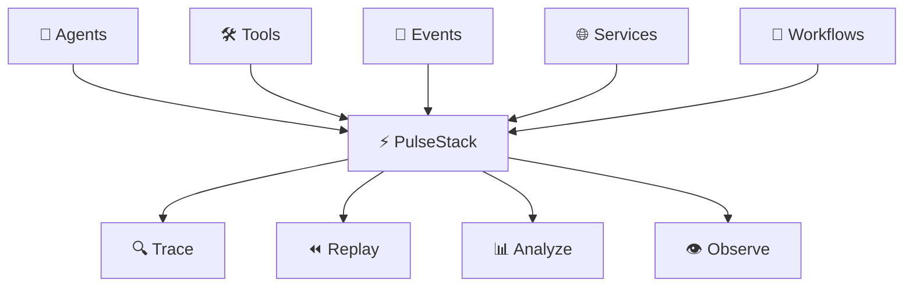
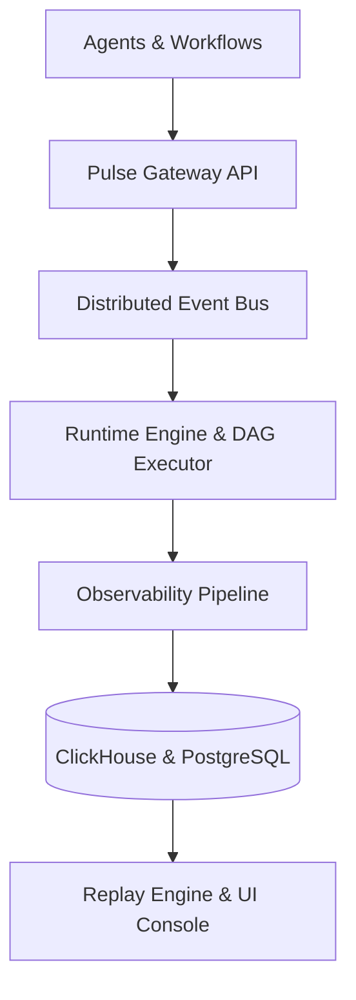
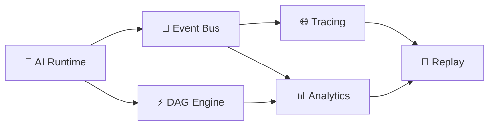
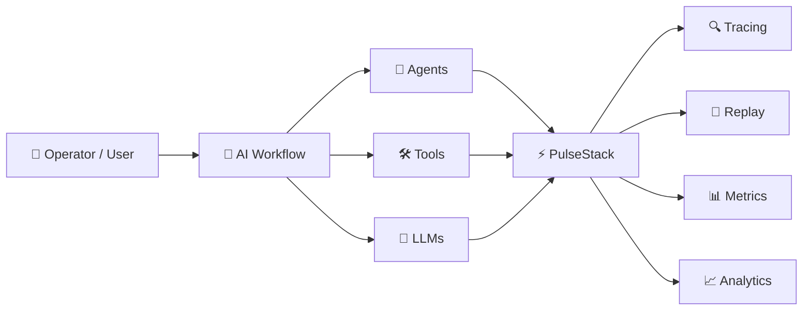
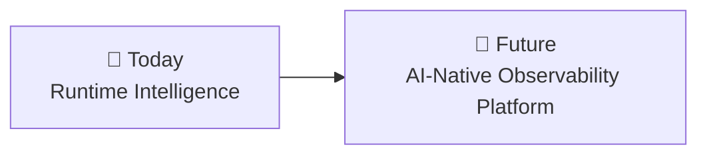

<div align="center">

# ⚡ PulseStack

### Observability • Replay • Runtime Intelligence

*Built for Distributed AI Systems, Agents, and Complex Workflows*

<br/>

<p>
  
  
  
  
</p>

<br/>

> **Trace every workflow. Replay every execution. Understand every decision.**

PulseStack provides deep visibility into AI-powered distributed systems, enabling teams to monitor execution flows, investigate failures, replay workflows, and gain actionable runtime insights—all from a unified observability layer.

</div>

---

## Why PulseStack Exists

Modern AI systems are no longer simple prompt-response applications.

Today's production environments consist of:

* 🤖 Multi-Agent Workflows
* 🔄 Distributed Automation Pipelines
* 🛠️ Tool-Calling Runtimes
* ⚡ Event-Driven Orchestrators
* 🧠 Long-Running Autonomous Systems
* 🌐 Cross-Service Execution Graphs

Yet most observability platforms were designed for:

* REST APIs
* Microservices
* Traditional Backend Applications
* Request/Response Lifecycles

They were **never built to understand AI-native execution flows.**

---

## The AI Observability Gap

```text
                    Traditional Monitoring

    Request ─────────► Service ─────────► Database
          ✓ Logs         ✓ Metrics          ✓ Traces


                     Modern AI Workflows

 User
   │
   ▼
 Agent A
   │
   ├──► Tool Call
   │
   ├──► Agent B
   │       │
   │       ├──► Memory Retrieval
   │       ├──► LLM Invocation
   │       └──► External API
   │
   └──► Workflow Orchestrator
             │
             ├──► Event Stream
             ├──► Retry Logic
             └──► Agent C

        ❌ Difficult to Trace
        ❌ Difficult to Replay
        ❌ Difficult to Debug
```

---

## The Problem

When AI workflows fail in production, teams struggle to answer critical questions:

* Which agent step failed?
* What event triggered the failure chain?
* Which tool call introduced latency?
* Why did the workflow generate inconsistent outputs?
* How can the execution be replayed deterministically?
* Which workflow version caused the regression?
* Which tenant experienced the issue?
* Where are tokens, retries, and infrastructure costs being consumed?

---

## ⚡ PulseStack Changes That

PulseStack introduces a purpose-built **Runtime Intelligence Layer** for AI-native systems, providing complete visibility into workflows, agents, tools, and execution paths.

By capturing every event, trace, decision, tool invocation, workflow transition, and execution artifact, PulseStack enables teams to:

* 🔍 Observe workflows in real time
* 🔄 Replay executions deterministically
* 🐞 Debug failures with full context
* 📊 Analyze performance and bottlenecks
* 🤖 Understand agent behavior at scale

> **From prompts to agents, tools, workflows, and distributed execution graphs — PulseStack turns AI systems from black boxes into fully observable, replayable, and debuggable platforms.**


---

# What PulseStack Solves

PulseStack provides a unified **Runtime Intelligence Layer** for modern AI systems.

It helps teams:

* 🔍 Trace distributed AI workflows in real time
* 🤖 Monitor multi-agent execution pipelines
* 🔄 Replay workflow runs deterministically
* 📊 Analyze bottlenecks and performance issues
* 🌐 Correlate events across services and agents
* 📈 Stream runtime telemetry at scale


> Turn complex AI workflows into observable, debuggable, and replayable systems.

---

# Core Architecture



> Every workflow event flows through the runtime layer, enabling real-time observability, deterministic replay, and deep execution insights.

---

# Features



| Feature                            | Description                                    |
| ---------------------------------- | ---------------------------------------------- |
| 🤖 **AI Workflow Runtime**         | Execute distributed AI workflows               |
| 🔄 **Distributed Event Pipeline**  | Real-time event streaming across services      |
| 🔁 **Deterministic Replay Engine** | Replay workflow executions for debugging       |
| 🌐 **OpenTelemetry Tracing**       | End-to-end execution visibility                |
| ⚡ **DAG Execution Engine**         | Dependency-aware workflow orchestration        |
| 🔌 **Plugin System**               | Custom runtime extensions and integrations     |
| 📊 **Runtime Analytics**           | Latency, retries, tokens, throughput, failures |
| 🖥️ **React Operations Console**   | Visual workflow and trace inspection           |
| ☸️ **Kubernetes + Helm**           | Production-ready deployment support            |

---

# 📦 Monorepo Structure

PulseStack follows a modular monorepo architecture, separating runtime services, shared packages, infrastructure assets, and extensibility layers.

```text
📦 apps/          → Runtime services & applications
📦 packages/      → Shared libraries & SDKs
☸️ infra/         → Deployment & infrastructure assets
🔌 plugins/       → Runtime extensions
📜 proto/         → Protocol definitions
```

```bash
apps/
  pulse-gateway/
  pulse-runtime/
  pulse-events/
  pulse-web/

packages/
  contracts/
  core/
  sdk/
  plugin-sdk/
  ui/

infra/
  docker/
  helm/
  k8s/

plugins/
  audit-log/

proto/
  pulsestack.proto
```

> 💡 Contributors interested in the internal execution model can explore the **[Distributed Runtime Architecture](docs/architecture/distributed-runtime.md)** documentation.

---

# 🛠️ Tech Stack

<div align="center">

|     **Layer**     |       **Technology**       |
| :---------------: | :------------------------: |
|     ⚙️ Runtime    |    Node.js + TypeScript    |
|    🔗 Transport   |      gRPC + WebSockets     |
|    📨 Messaging   |            NATS            |
|  📈 Observability |        OpenTelemetry       |
|    📊 Analytics   |         ClickHouse         |
|  🗄️ Persistence  |         PostgreSQL         |
|    🖥️ Frontend   |        React + Vite        |
| ☸️ Infrastructure | Docker · Kubernetes · Helm |
|    📦 Monorepo    |        Turbo · pnpm        |

</div>

---

## PulseStack Overview



---

# 🚀 Local Development

### Prerequisites

Before getting started, ensure the following tools are installed:

* 📦 Node.js 20+
* ⚡ pnpm
* 🐳 Docker

---

### 1️⃣ Start Infrastructure

```bash
docker compose -f infra/docker/docker-compose.yml up -d
```

### 2️⃣ Install Dependencies

```bash
pnpm install
```

### 3️⃣ Start Development Environment

```bash
pnpm dev
```
---

# 🌐 Local Services

| Service         | Endpoint                     |
| --------------- | ---------------------------- |
| 🚪 Gateway API  | `http://localhost:4000`      |
| 🖥️ Runtime UI  | `http://localhost:3000`      |
| 📚 Swagger Docs | `http://localhost:4101/docs` |

> 💡 Once the development environment is running, open the Runtime UI to inspect workflows, traces, and replay sessions.

## Environment Setup

Create a `.env` file from the example file:

### Linux/macOS

```bash
cp .env.example .env
```

### Windows CMD

```cmd
copy .env.example .env
```

### Windows PowerShell

```powershell
Copy-Item .env.example .env
```

## Environment Variables

| Variable | Purpose | Default Value |
|----------|---------|---------------|
| RUNTIME_URL | Runtime engine service | http://localhost:4101 |
| EVENTS_URL | Event streaming service | http://localhost:4102 |
| TRACE_URL | Tracing service | http://localhost:4103 |
| REPLAY_URL | Replay engine | http://localhost:4104 |
| METRICS_URL | Metrics service | http://localhost:4105 |
| GRAPH_URL | Workflow graph service | http://localhost:4106 |
| VITE_GATEWAY_URL | Frontend gateway URL | http://localhost:4000 |

A sample `.env.example` file is included with default local development values.

## Troubleshooting

### Port already in use

Stop conflicting local services or change ports.

### Docker services not starting

Ensure Docker Desktop is running before executing:

```bash
docker compose -f infra/docker/docker-compose.yml up -d
```

### pnpm command not found

Install pnpm globally:

```bash
npm install -g pnpm
```

### Docker command not found

Ensure Docker Desktop is installed and running before starting infrastructure services.

# 📝 Example Workflow Payload

The following example demonstrates a simple AI workflow consisting of an **Agent → Tool → LLM** execution chain.

```text id="qomqyi"
Plan Agent
    │
    ▼
Fetch Logs
    │
    ▼
Summarize with LLM
```

```json id="y2wcfb"
{
  "workflow": {
    "id": "wf_agent_ops",
    "name": "Agent Ops",
    "version": "1.0.0",
    "tenantId": "local",
    "correlationId": "corr_agent_ops",
    "metadata": {},
    "steps": [
      {
        "id": "s1",
        "name": "Plan",
        "kind": "agent",
        "dependsOn": [],
        "input": {
          "objective": "inspect queue health"
        }
      },
      {
        "id": "s2",
        "name": "FetchLogs",
        "kind": "tool",
        "dependsOn": ["s1"],
        "retry": {
          "maxAttempts": 3,
          "backoffMs": 250,
          "maxBackoffMs": 2000,
          "exponential": true
        },
        "input": {
          "tool": "logs.query",
          "range": "15m"
        }
      },
      {
        "id": "s3",
        "name": "Summarize",
        "kind": "llm",
        "dependsOn": ["s2"],
        "input": {
          "model": "gpt-4.1",
          "prompt": "Summarize anomalies"
        }
      }
    ]
  },
  "input": {
    "environment": "prod"
  },
  "initiatedBy": "operator"
}
```

## Runtime Retry Policies

Workflow steps can opt into bounded retry handling with a `retry` policy:

```json
{
  "id": "fetch_logs",
  "name": "Fetch logs",
  "kind": "tool",
  "retry": {
    "maxAttempts": 3,
    "backoffMs": 250,
    "maxBackoffMs": 2000,
    "exponential": true
  },
  "input": {
    "tool": "logs.query"
  }
}
```

Retries are disabled by default (`maxAttempts: 1`). When enabled, PulseStack emits `step.retrying`
events before another attempt, emits `step.failed` when attempts are exhausted, records retry metadata
in execution output and snapshots under `__retry`, and marks the workflow as failed instead of leaving
the execution in a running state.

---

# 🗺️ Roadmap



* 🔐 Multi-Tenant Isolation
* 👥 RBAC & Authentication Providers
* ⏪ Workflow Time-Travel Debugger
* 💰 Token Cost Analytics
* 🧠 Agent Memory Visualization
* 🌐 Live Workflow Graph Rendering
* 🔄 Distributed Replay Clustering
* 🤖 ML-Based Anomaly Detection
* 🛡️ AI Safety Event Auditing
* 🔭 Runtime Health Dashboards
* 📈 Predictive Workflow Insights
* 🔗 CNCF & OpenTelemetry Integrations

---

### Vision

> Build the observability platform that AI systems deserve — where every workflow, agent, event, decision, and execution path can be traced, replayed, analyzed, and understood.

---

# 🌍 Open Source Vision

PulseStack is being built as:

* 🌐 An open observability standard for AI-native systems
* 🏗️ A contributor-first infrastructure project
* 🔍 A foundation for next-generation AI debugging and runtime intelligence
* 🚀 A platform for building reliable, observable, and replayable AI workflows

### 🤝 Who Can Contribute?

We welcome:

* Open Source Contributors
* Infrastructure Engineers
* AI Runtime Builders
* Observability Engineers
* GSoC & GSSoC Contributors
* Distributed Systems Enthusiasts

> **Join us in shaping the future of AI observability, replay, and runtime intelligence.**

---

# 🤝 Contributing

Get started locally in a few minutes:

```bash
git clone https://github.com/sreerevanth/PulseStack.git
cd PulseStack
pnpm install
pnpm dev
```

We welcome issues, feature requests, discussions, documentation improvements, and pull requests from contributors of all experience levels.

---

# 📜 License

Distributed under the **MIT License**.

---

# ⚡ PulseStack

> Building observability infrastructure for the next generation of autonomous systems.

---

# ❤️ Credits

### Core Contributors

| Contributor      | Role                                                   |
| ---------------- | ------------------------------------------------------ |
| **@sreerevanth** | Founder, Initial Design, System Architecture           |
| **Contributors** | Development, Documentation, Testing, Community Support |

### Special Recognition

* 💡 Idea & Vision — **@sreerevanth**
* 🏗️ Initial System Design — **@sreerevanth**
* 🚀 Project Founder — **@sreerevanth**

---

<p align="center">
  <b>Made with ❤️ by the open-source community.</b>
</p>
